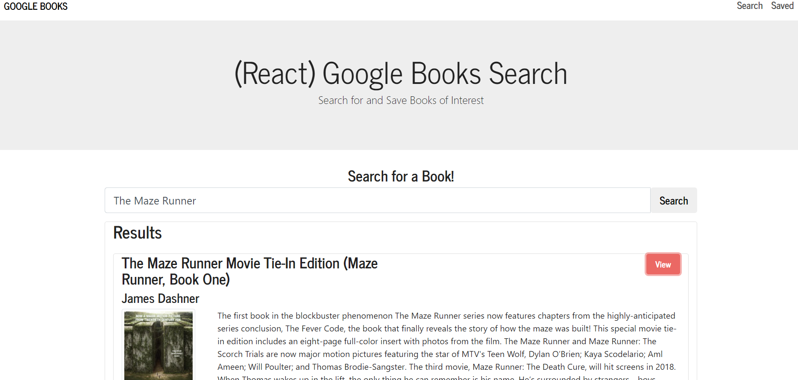

# Employee-Directory
## Description
  ---
  This project is my first MERN app that allows the user to search for a book within the Google Books API. The user is then able to view the link to the book they are interested in , save the book for later, or delete past saved books. MonogoDB as well as express, axios, and react router were utilized in this project.
  ## Table of Contents 
  --- 
  [Application](#application)

  [Usage](#usage)

  [Contributing](#contributing)

  [Questions](#questions)

  [Link](#deployedLink)

  ## Application
  ---
  
  ## Usage
  ---
  * Type in a type of book or specific book into the search bar and then click search
  * Once results are populated click view to be directed to the preview link for that book
  
  ## Contributing
  ---
  * Lorena Ramirez
  * Referenced past activities provided by UNCC Coding Bootcamp
  ## Questions
  ---
  To reach me with additional questions please contact me with one of the following below.
  * My github profile - [Github Link](https://github.com/Lorena-Ramirez)
  * Email - <ramirezlorenaa18@gmail.com>

 ## Link
  ---
  [Deployed Site](https://agile-cove-31662.herokuapp.com/)
